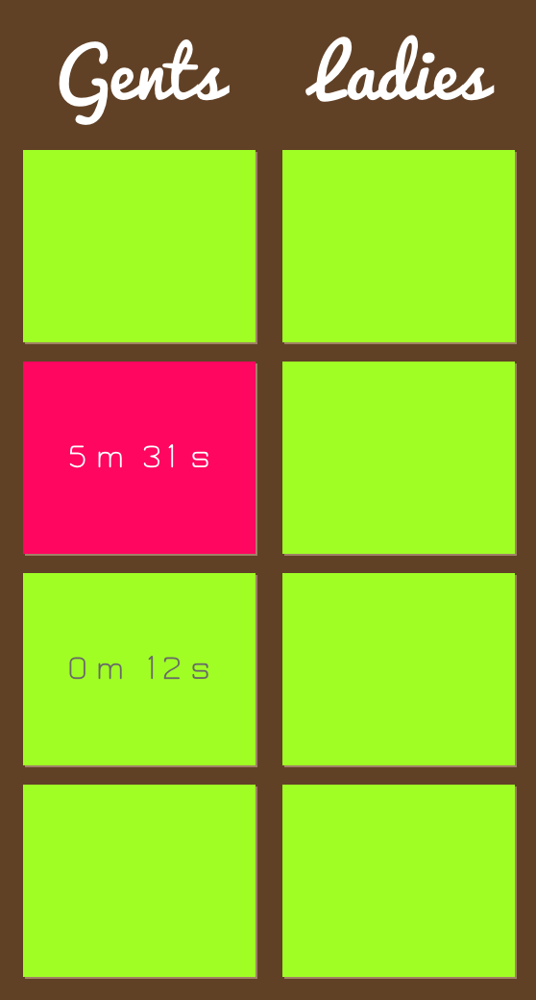

# Toilet as a Service

> TaaS brings the power of WebSockets into your toilet.

From now you are always up-to-date with your favourite cabins availability. Enjoy the missing websocket interface in your cabin. Brought to you by Raspberry Pi.

```
npm install && npm start
```



## Caveats

TaaS was written within couple of hours during Roboton event organised by Allegro Group in Toruń, Poland. It's useless unless you have required hardware + middleware.
